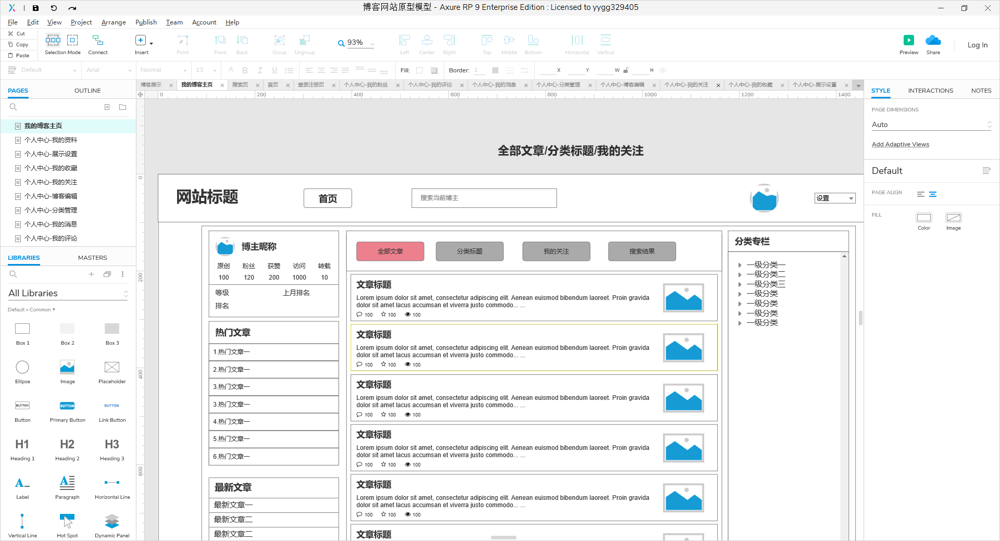

### KEYI-BLOG

---
> 该项目是个人大学期间的作品，整个项目是从0到1开发的。本人主要从事后端开发，当时技术功底尚浅，使用的技术也比较单一，系统存在很多瓶颈，因此项目仅供学习使用；
> 感兴趣的伙伴可以私信本人，一起学习分享；项目亮点主要在于系统设计的过程；
>
> 本人邮箱：ke_yi_zhou@163.com ; 技术交流QQ群：386445595 ;
#### 项目介绍：
一个博客系统，包含用户注册、登陆、设置技术标签、写文章、文章分类、文章管理、个人信息管理、主页（热门文章、热门用户、热门评论等）

#### 使用技术：
- 后端框架：spring+spring-mvc+mybatis、shiro、jsp
- 前端框架：bootstrap、editormd
- 数据库：mybatis
- 服务器：tomcat
- 包管理：maven
- 设计工具：Axue、visio、PowerDesigner
- 开发工具：IDEA、HBuild
#### 原型设计：
使用Axue设计[原型图](readmedir/doc/原型图.md)，主要的原型图，如下：

#### 流程设计：
用visio做的[流程设计](readmedir/doc/流程设计.md)，主要的设计图，如下：

#### 实体详细设计：
对应的创建数据表的[sql](readmedir/file/create-table.sql)；

#### 最终展示效果：
[详细效果](readmedir/doc/效果展示.md)，主页效果如下：
（后台管理系统，使用若依快速实现的，项目链接：[若依](https://gitee.com/y_project/RuoYi)）

