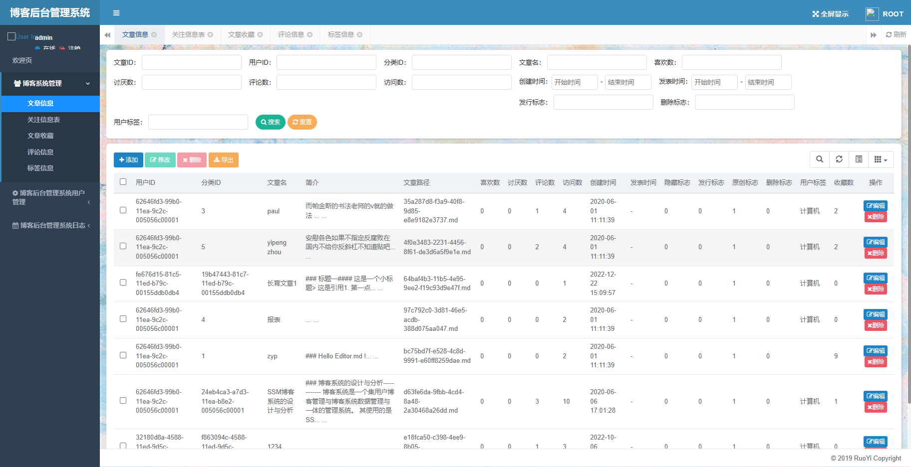

[返回README](../../README.md)

主页效果：

分类效果：

博客展示效果：

博客展示效果：（自己的博客可以直接编辑）

博客展示效果：（评论）

搜索效果：（文章）

搜索效果：（用户）

个人中心效果：（个人资料）

个人中心效果：（关注）

个人中心效果：（分类管理）

个人中心效果：（收藏）

个人中心效果：（文章编辑）

后台管理直接使用若依实现：

[返回README](../../README.md)

